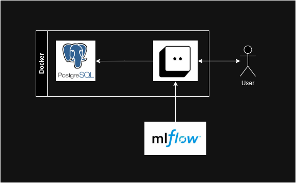

# Architecture :triangular_ruler:
## **Architecture Diagram**

The following project has been build in a simplified architecture which relies on 3 main tools.

1. **PostgresSQL**: This is being used as the application database whete we will store the 3 tables used (user_last_access, last_news and last_news_ranking)
2. **BentoML**: BentoML is the engine that we are using in this project to register and serve the ML models.
3. **Docker**: With Docker we conteinerize the ML API, the postgress SQL and finally we deployed it together with docker-compose.

Below you can see an image of this architecture:

